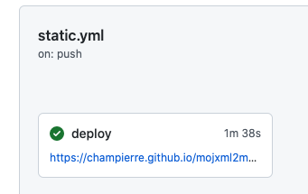

# mojxml2map

[法務省登記所備付地図データ](https://front.geospatial.jp/houmu-chiseki/)を簡単に地図上([Geolonia Maps](https://geolonia.com/maps-dev/))に表示します。


## 使い方

- [法務省登記所備付地図データ](https://front.geospatial.jp/houmu-chiseki/)　より目的の xml ファイルをダウンロードします。

- [champierre/mojxml2map](https://github.com/champierre/mojxml2map) を git clone します。

```
git clone git@github.com:champierre/mojxml2map.git
```

- クローンした mojxml2map 以下の data フォルダの下に、xml ファイルをコピーしファイル名を data.xml に変更します。

```
cd mojxml2map
cp <filename of the xml file>.xml data/data.xml
```

- 変更をコミットして、リポジトリに push します。

```
git add .
git commit
git push origin main
```

- Actions タブをクリックすると、GitHub Actions で xml ファイルを GeoJSON ファイルに変換し、地図上に地番を表示するように加工する様子を確認できます。処理が終わるまでしばらく待ちます。

- 処理が完了すると、GitHub Pages の URL が表示されるので、それをクリックします。



- 変換が成功していれば、以下のように地図上に区分けされた地番が表示されます。


