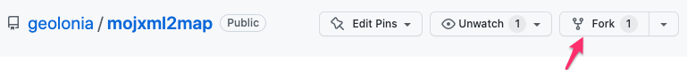
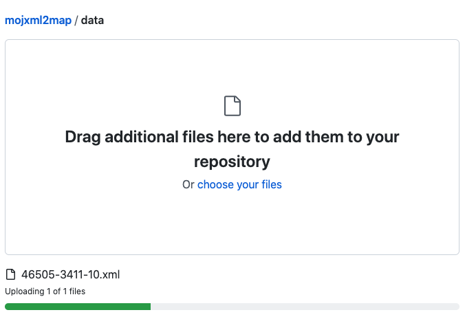
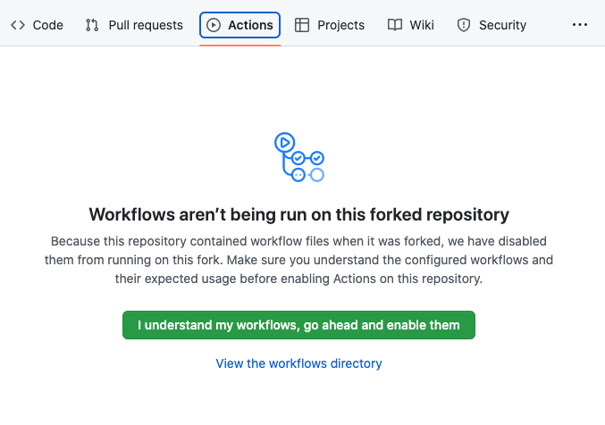
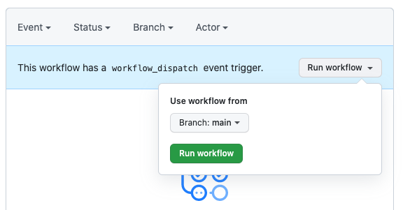
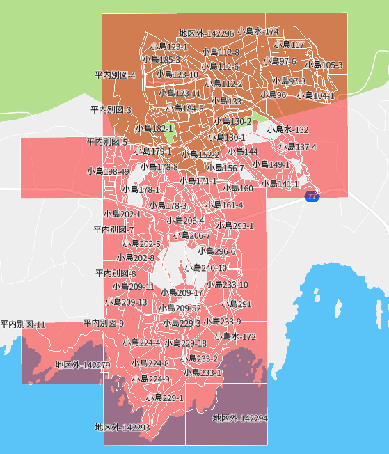

# mojxml2map

GitHub 上の操作だけで、[法務省登記所備付地図データ](https://front.geospatial.jp/houmu-chiseki/)を簡単に地図上([Geolonia Maps](https://geolonia.com/maps-dev/))に表示します。必要なものは GitHub アカウントだけです。

## 使い方

- [法務省登記所備付地図データ](https://front.geospatial.jp/houmu-chiseki/)　より地図上に表示したい xml ファイルをダウンロードしておきます。各 xml ファイルは zip で圧縮してあるので解凍します。

- [geolonia/mojxml2map](https://github.com/geolonia/mojxml2map) を自分のリポジトリにフォークします。

- Settings タブ、左メニューから Pages を選び、Source に GitHub Actions を選択します。

- Code タブを選択し、data フォルダを選びます。xml ファイルをドラッグ&ドロップしてアップロードします。アップロードが終わったら、画面下の方の Commit changes ボタンを押します。

- Actions タブを選び I understand ... ボタンをクリックします。

- 左メニューの Deploy static content to Pages を選択し、Run workflow で GitHub Actions に設定してある workflow を開始します。

- workflow では、デジタル庁より公開されている[法務省登記所備付地図データ（地図XML）をGeoJSONに変換するコンバータ](https://github.com/JDA-DM/mojxml2geojson)を使って xml ファイルを GeoJSON ファイルに変換し、地図上で地番とともに表示されるように加工してから GitHub Pages 上にページを用意します。

- 処理が完了すると、GitHub Pages の URL が表示されるのでクリックします。

- 変換が成功していれば、以下のように地図上に区分けされた地番が表示されます。

